# SpaceX (Orange Systems Technical Task)

This repository contains my implementation of the **Orange Systems** iOS technical task.  
The app lists SpaceX launches, shows a details screen with an embedded YouTube player, and lets users favorite launches (persisted locally).

## Tech & Architecture
- **SwiftUI**, **Combine**
- **MVVM** + lightweight **Coordinator** + **DI** via `ViewModelFactory`
- **Core Data** for favorites (`FavoriteLaunch` with unique `id`)
- Cached images with `NSCache` + `URLCache`
- Unified loading/empty/error UI via `StateView`
- **YouTubePlayerKit** (SPM) for video playback

## Endpoints (SpaceX v4)
- `GET /v4/launches/past`
- `GET /v4/launches/{id}`
- `GET /v4/rockets/{id}`
- `GET /v4/payloads/{id}`

## Requirements
- Xcode 15.4+ • iOS 17+
- No API keys required. Dependencies resolved via **Swift Package Manager**.

## Running
1. Clone the repo and open `SpaceX.xcodeproj` in Xcode.
2. Select an iOS 17+ simulator (or device).
3. Build & Run.

## Notes
- Details VM is created with `@StateObject` to avoid recreation and keep scroll/player stable.
- Favorites are synced across screens via a single `FavoritesStore`.
- Tests include stubs/mocks for repository and favorites store.

## Screenshots

### Main Screens (Light / Dark)

| Screen        | Light                                                                 | Dark                                                                  |
|---------------|-----------------------------------------------------------------------|-----------------------------------------------------------------------|
| **Launches**  | 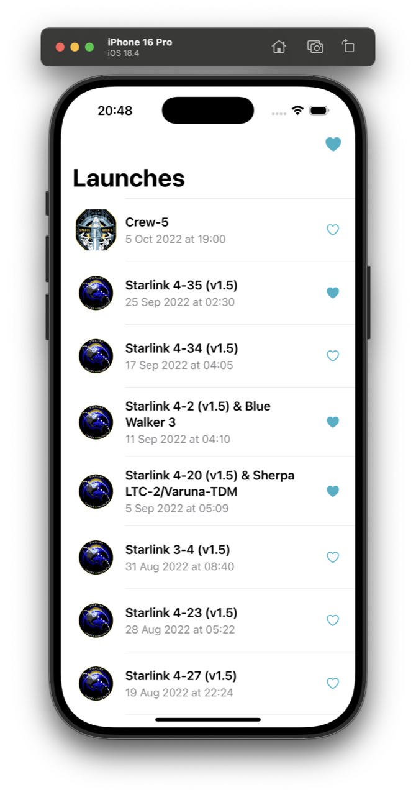 | 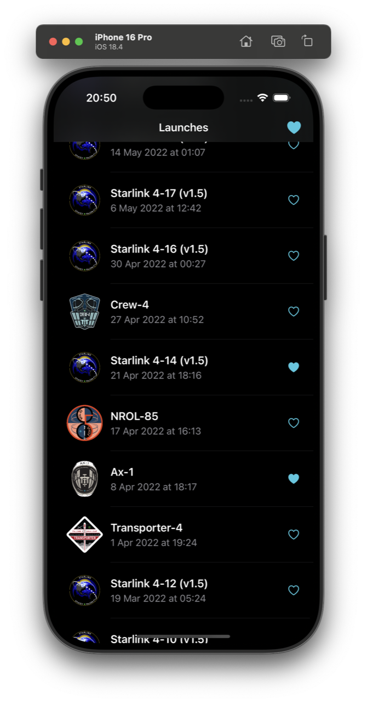  |
| **Details**   | 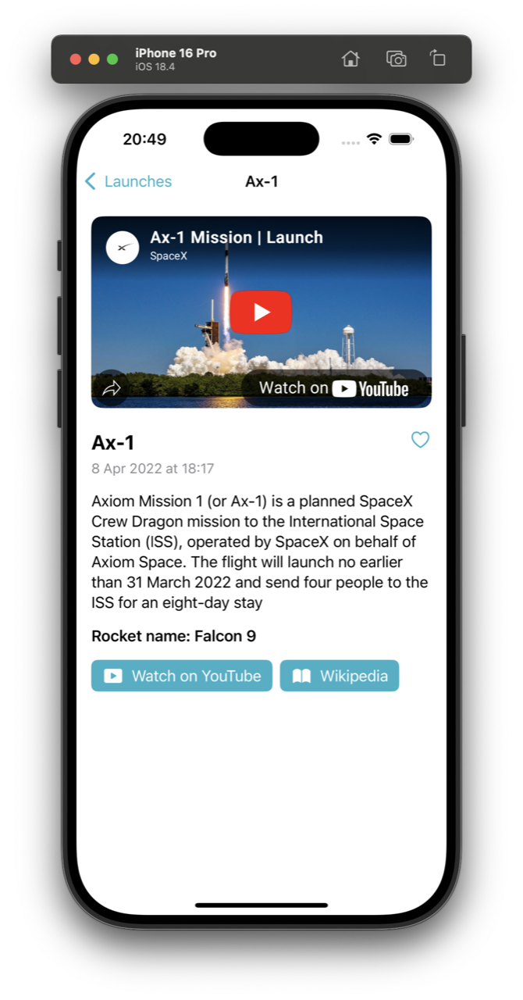  | 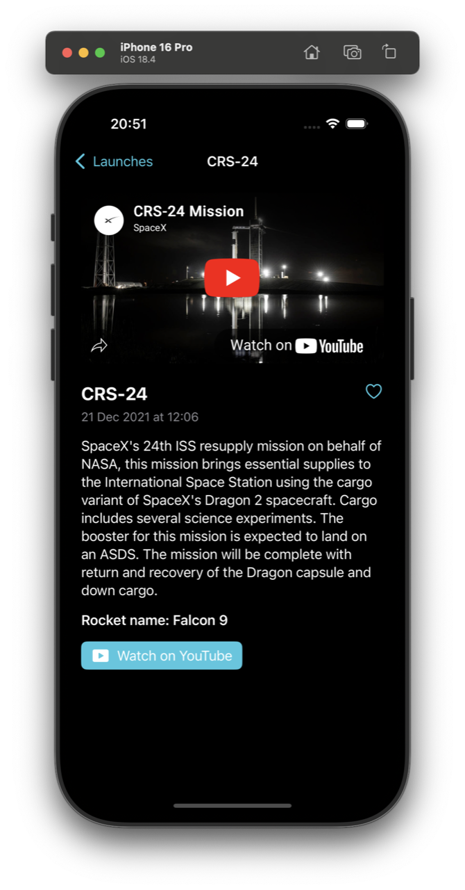   |
| **Favorites** | 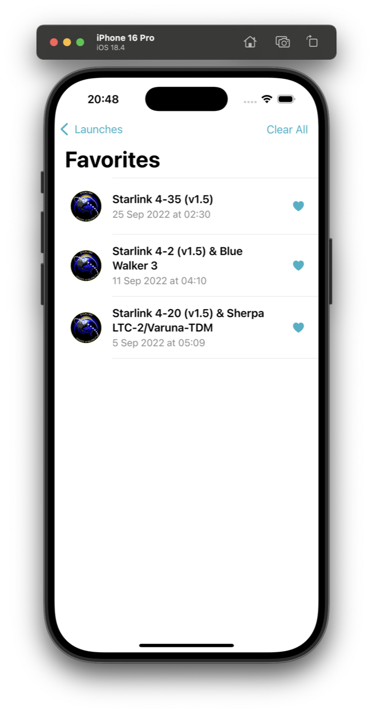| 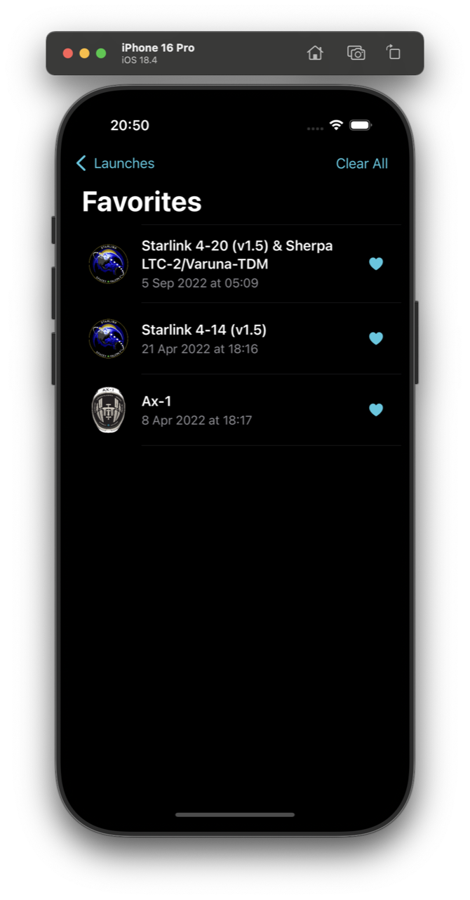|
| **No Favorites** | 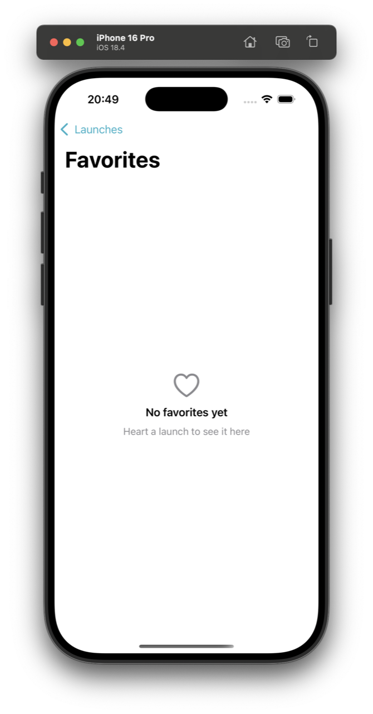 | 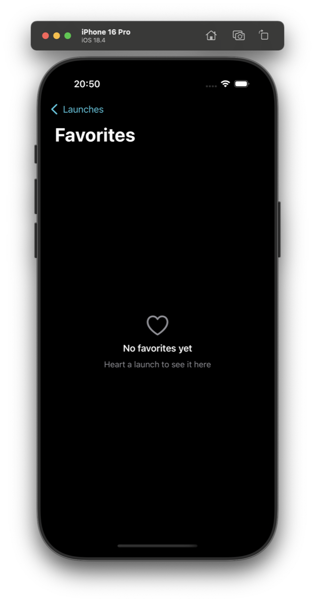 |

---

### Actions

| Action                    | Dark                                                                 | Light                                                                 |
|---------------------------|----------------------------------------------------------------------|-----------------------------------------------------------------------|
| **Add to Favorites**      | 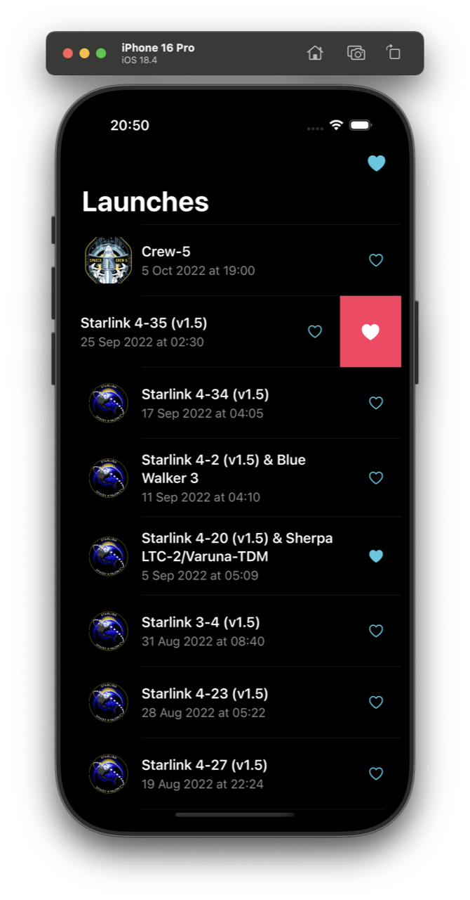 | — |
| **Remove from Favorites** | 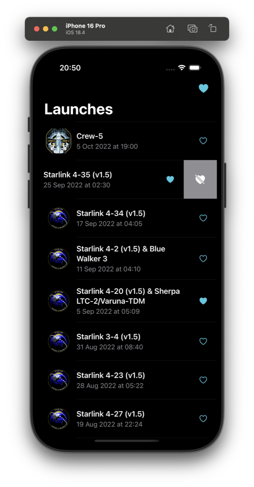 | 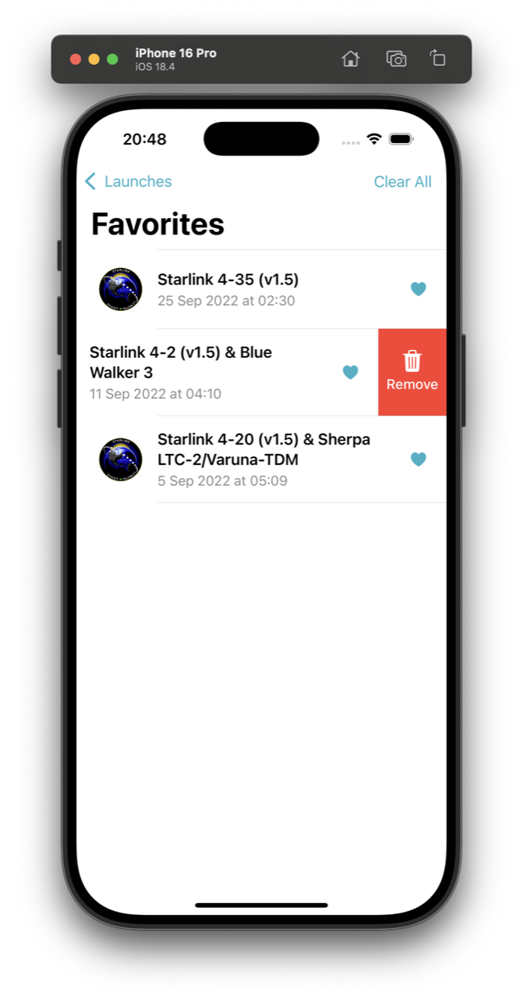 |

---

### Landscape

| Launches (Landscape)                                                   | Details (Landscape)                                                   | No Favorites (Landscape)                                                  |
|------------------------------------------------------------------------|------------------------------------------------------------------------|---------------------------------------------------------------------------|
| 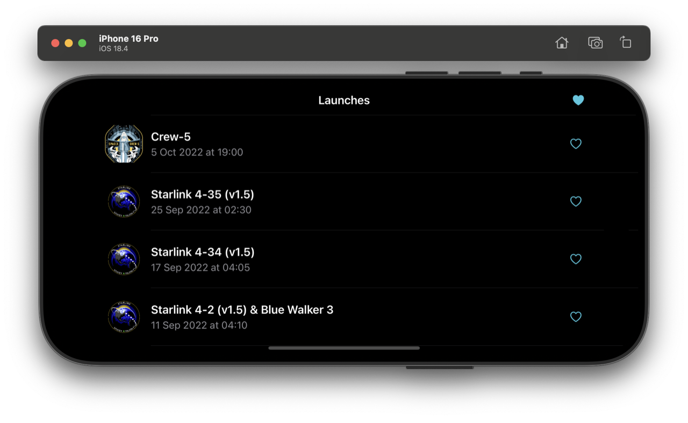 | 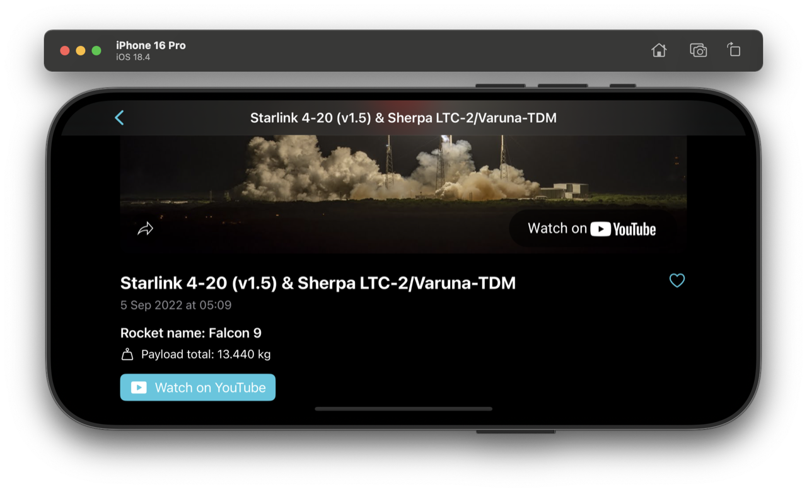 | 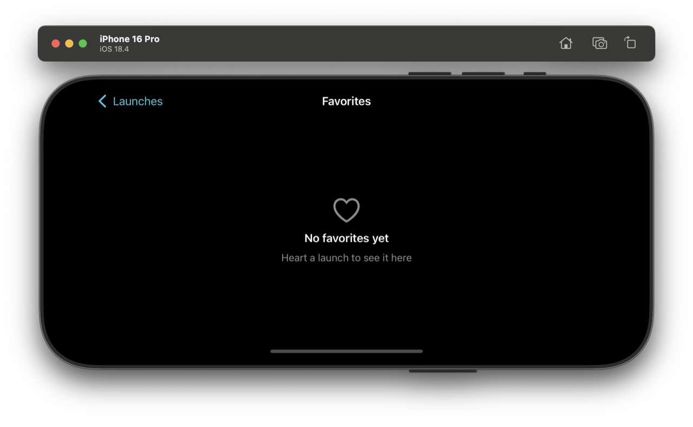 |

---

### Extras

| Details (with picture)                                                  | Wikipedia Link                                                        |
|-------------------------------------------------------------------------|-----------------------------------------------------------------------|
| 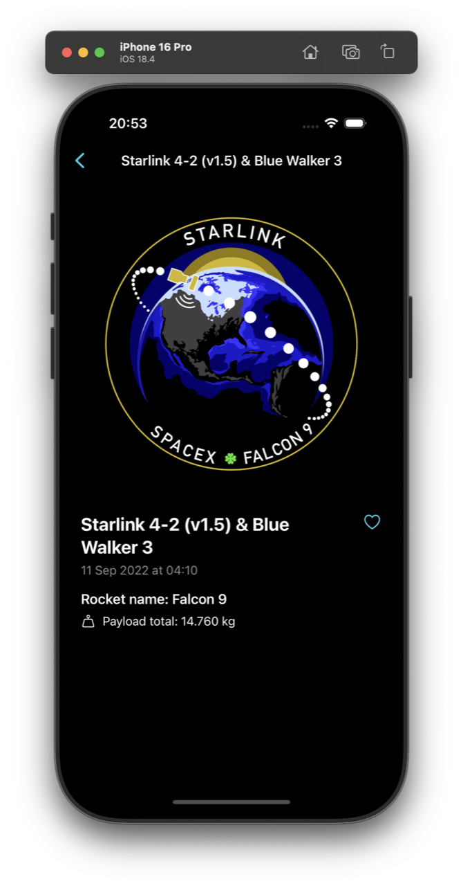 | 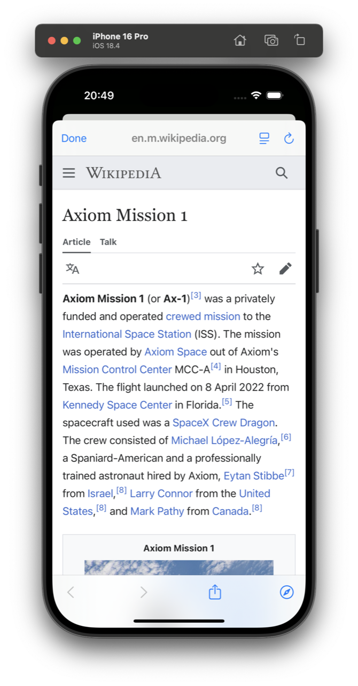                 |

---

© Orange Systems technical task • 2025
